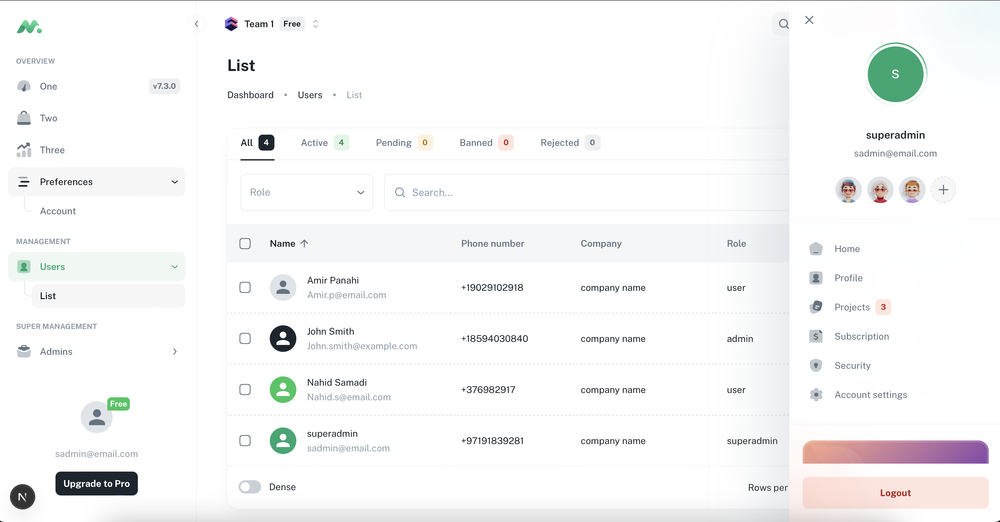
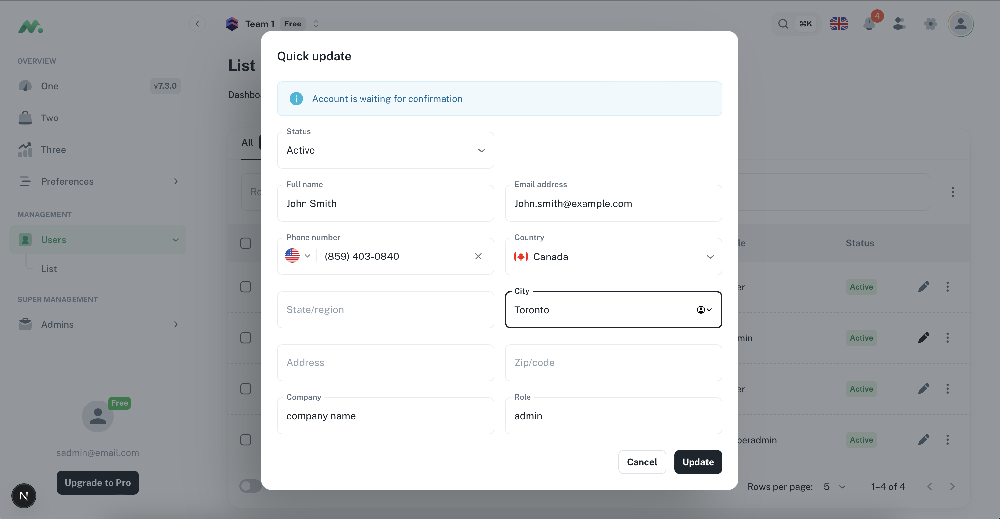
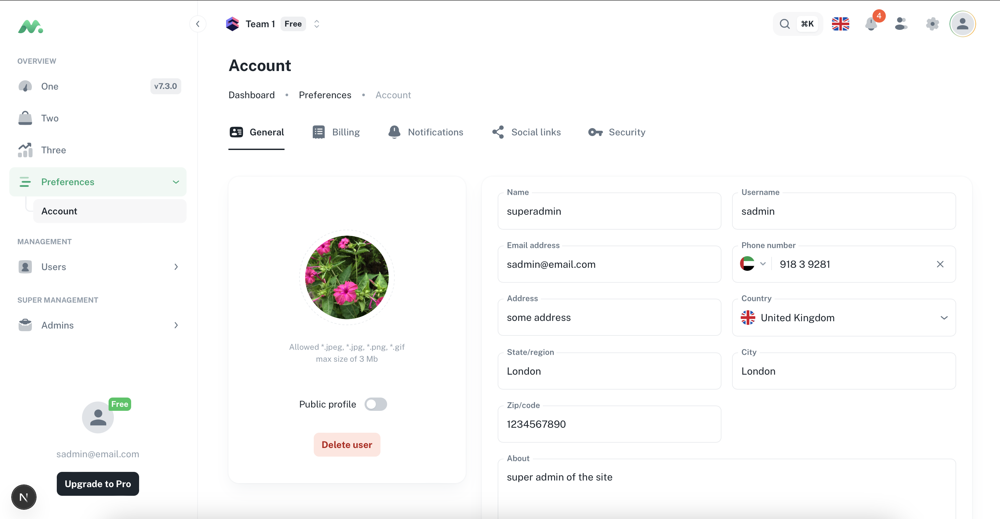

# Role-Based Dashboard with MUI & Django Backend

This project is a **role-specific dashboard** built using **Next.js** and **Material UI (MUI)**.  
It provides a modern, responsive frontend for three distinct roles:

- **User**
- **Admin**
- **Super Admin**

It also integrates with a **Django backend** (sample backend provided in `sample_backend/`) for authentication, role management, and data handling.

---

## ✨ Features

### 🔐 Authentication
- Login & Sign-up pages with JWT-based authentication.
- Role-based session management.

### 📊 Dashboards
Each role has its own dashboard:
- **User Dashboard**: Profile management, personal data, and general features.
- **Admin Dashboard**: User management and role assignment.
- **Super Admin Dashboard**: Full system control, including admin management and access to system-wide analytics.

### 👤 Profile Management
- Edit and update user profile.
- Manage password and personal information.

### 🛠️ Admin/Super Admin Tools
- **User Management**: View, edit, and remove users.
- **Admin Management**: Super admin can promote/demote admins.
- Extendable modular design for adding new sections easily.

---

## ⚙️ Prerequisites

- **Node.js >= 20** (Recommended)  
- **Python >= 3.10** (for Django backend)  

---

## Project Screenshots




## 🚀 Frontend Setup (MUI + Next.js)

1. Clone the repository:

```bash
git clone https://github.com/saniazzt/Mui-Frontend.git
cd Mui-Frontend
```

2. Install dependencies:
Using Yarn (recommended):
```bash
yarn install
yarn dev
```

Using NPM:
```bash
npm install
npm run dev
```

The frontend will be available at:
http://localhost:3000

## 🖥️ Backend Setup (Django)
The frontend integrates with a Django backend (see sample_backend/).
1. Navigate to backend folder:
```bash
cd sample_backend
```
2. Create and activate a virtual environment:
```bash
python -m venv venv
# Windows
venv\Scripts\activate
# macOS/Linux
source venv/bin/activate
```
3. Install dependencies:
```bash
pip install -r requirements.txt
```

3. Apply migrations:
```bash
python manage.py migrate
```
4. Run the server:
```bash
python manage.py runserver
```
Backend runs at:
http://127.0.0.1:8000/